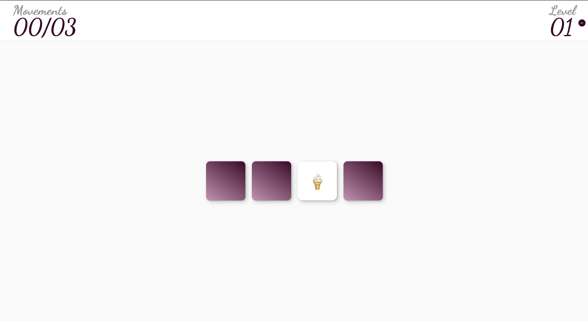
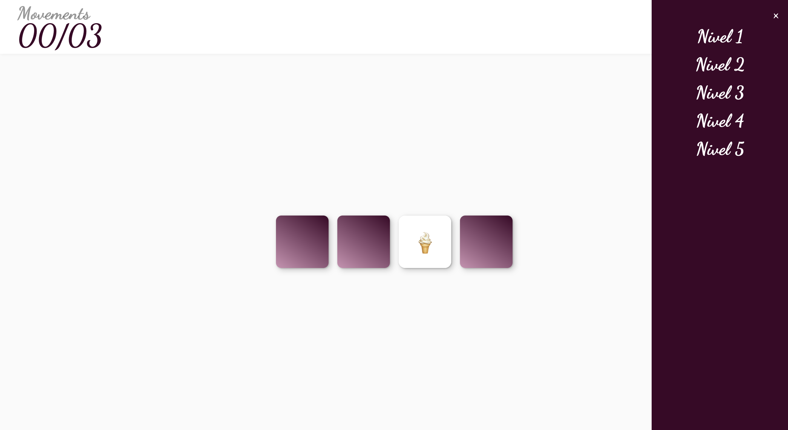
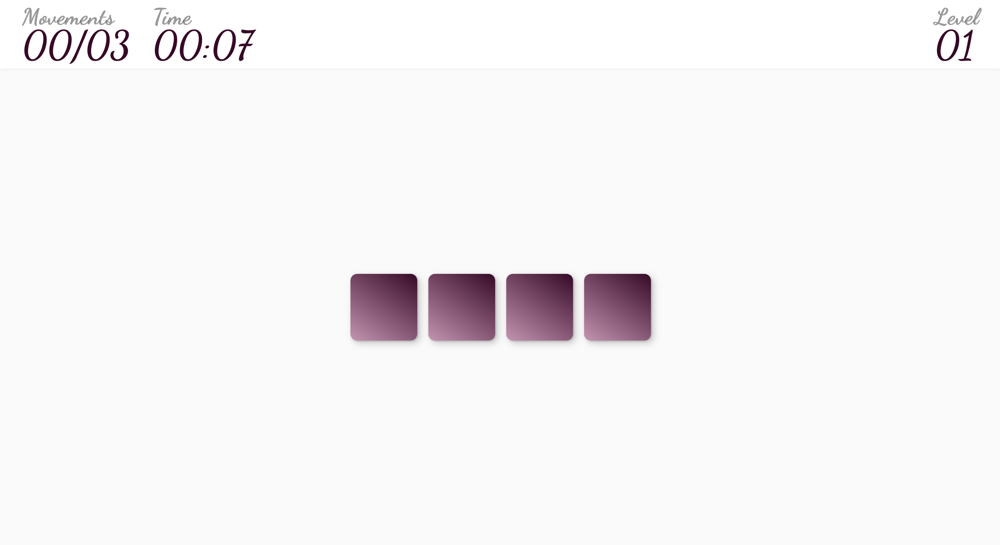
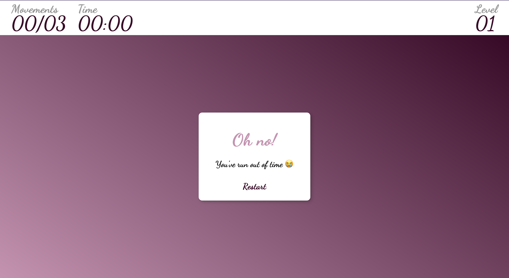

# Makeup Memory (Final Project JavaScript Domestika)
---
## About the Game
Makeup Memory is a basic 5-level game in which the player will have to challenge their memory by clicking on the cards and seeing the different emojis that it has until they match with the same one.

There are two moods in this game, they are "relax" and "normal".

In the first one like the name suggests the player can select whichever level that their want and take as moves and time as they want, which is like a practice mood.

In the second one we count the movements and the time.

If the player is with 0 of any of this he/she will have to start from level 1.

## Play the Game!!! 
Here I leave the website to try it!
https://manufloresuwu.github.io/FinalProject-Javascript-Course-Domestika/

## Links Used to Complete the Game
- https://www.w3schools.com/cssref/playdemo.php?filename=playcss_background-image&preval=url(%27paper.gif%27)
- https://www.w3schools.com/cssref/pr_background-image.php